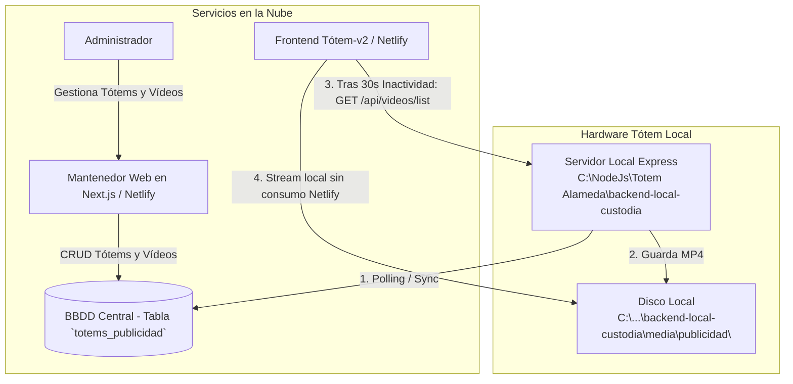

# Plan de Trabajo: Módulo de Publicidad por Inactividad y Mantenedor de Tótems

Implementación de un sistema de protector de pantalla publicitario (screen saver) para tótems de venta de pasajes con 30 segundos de inactividad, controlado desde un mantenedor web en **Next.js** (CRUD de tótems y hasta 3 videos de publicidad por tótem), respaldado por una tabla específica en la BBDD central y sincronizado con el servidor local del tótem (`backend-local-custodia`).

---

## Architecture Overview

---

## Estrategia Confirmada

1. **Mantenedor Web**: Se desarrollará como una aplicación **Next.js** (alojable en Netlify/Vercel).
2. **Servidor Local del Tótem**: Ubicado en `C:\NodeJs\Totem Alameda\backend-local-custodia`.
3. **Base de Datos Central**: Creación de tabla dedicada (`totems_publicidad` / `totem_videos`) en la BBDD central.

---

## Cambios Propuestos

---

### Componente 1: Detector de Inactividad y Pantalla Publicitaria en `Totem-v2` (Vue.js)

#### [NEW] [IdleAdScreenSaver.vue](file:///c:/NodeJs/Totem%20Alameda/Totem-v2/src/components/IdleAdScreenSaver.vue)
- Componente overlay a pantalla completa con soporte para lista de reproducción secuencial (Playlist de 1 a 3 videos).
- Atributos para reproducción fluida sin restricciones de navegador: `autoplay`, `muted`, `loop`, `playsinline`.
- Al tocar o hacer clic en cualquier parte de la pantalla: oculta la publicidad, restablece la sesión y emite el evento de retorno a `Home`.

#### [NEW] [idleTimer.js](file:///c:/NodeJs/Totem%20Alameda/Totem-v2/src/mixins/idleTimer.js)
- Escuchador global de interacción del usuario (`click`, `touchstart`, `mousemove`, `pointerdown`).
- Temporizador de inactividad de 30 segundos.
- Al vencer el tiempo: consulta al servidor local (`https://${ipServer}:3000/api/videos/list`) para obtener los videos descargados y activa la pantalla `IdleAdScreenSaver`.

#### [MODIFY] [App.vue](file:///c:/NodeJs/Totem%20Alameda/Totem-v2/src/App.vue)
- Integración del mixin `idleTimer` y renderizado del componente `<idle-ad-screen-saver />` en la raíz.
- Limpieza automática de la sesión al salir del modo publicidad.

---

### Componente 2: Servidor Local del Tótem (`backend-local-custodia`)

Ubicado en `C:\NodeJs\Totem Alameda\backend-local-custodia`:

#### [MODIFY] Servidor Local Express (`backend-local-custodia`)
- **Directorio de Almacenamiento**: Creación del directorio local `media/publicidad/` para alojar los archivos `.mp4`.
- **Endpoint `GET /api/videos/list`**: Devuelve el arreglo de videos presentes en el disco local.
- **Servicio de Sincronización Automática (Worker)**:
  - Consulta periódicamente la tabla específica en la BBDD central.
  - Compara la lista de videos asignados a la IP/ID de este tótem.
  - Descarga archivos nuevos al disco local y elimina videos dados de baja.

---

### Componente 3: Base de Datos Central (Tabla Específica)

#### [NEW] Tabla `totems_publicidad` / `totem_videos`
- Estructura propuesta:
  - `id` (INT / UUID)
  - `totem_id` (VARCHAR - Identificador/Nombre del Tótem)
  - `totem_ip` (VARCHAR - Dirección IP local del tótem)
  - `video_slot` (INT - Slot 1, 2 o 3)
  - `video_url` (VARCHAR - URL o ruta del video en almacenamiento central)
  - `video_name` (VARCHAR - Nombre descriptivo del video)
  - `is_active` (BOOLEAN - Estado activo/inactivo)
  - `updated_at` (TIMESTAMP)

---

### Componente 4: Mantenedor Web en **Next.js**

Aplicación independiente en Next.js para administrar tótems y campañas de video.

#### [NEW] Aplicación Next.js (Panel Admin)
- **Vista Dashboard / Tótems**:
  - Lista de los 10 tótems registrando nombre, IP local, estado en línea/offline y total de videos activos.
  - Funcionalidades CRUD completas (Crear tótem, Editar IP/Nombre, Eliminar tótem).
- **Vista Gestión de Vídeos por Tótem**:
  - Interfaz gráfica para gestionar los 3 slots de video por tótem.
  - Carga de archivos MP4 y asignación a la tabla en la BBDD central.
  - Opción de despliegue masivo ("Asignar campaña a todos los tótems").

---

## Plan de Verificación

### Pruebas Automatizadas
- Compilación del proyecto frontend Vue (`vite build`) en `Totem-v2`.
- Verificación del build del proyecto Next.js (`npm run build`).

### Pruebas Manuales
1. **Prueba de Inactividad (30s)**:
   - Dejar el tótem sin interacción por 30 segundos y verificar el despliegue del protector de pantalla.
2. **Prueba de Reproducción y Reseteo**:
   - Verificar la secuencia de reproducción (hasta 3 videos) desde el backend local sin tráfico a Netlify.
   - Tocar la pantalla y comprobar que el video se cierre inmediatamente y redirija a `Home`.
3. **Prueba del Mantenedor Next.js**:
   - Crear/Editar un tótem en el Mantenedor Next.js, asignar 3 videos y verificar que la tabla en la BBDD central se actualice.
4. **Prueba de Sincronización Local**:
   - Confirmar que `backend-local-custodia` descargue los videos asignados a la carpeta `media/publicidad/`.
